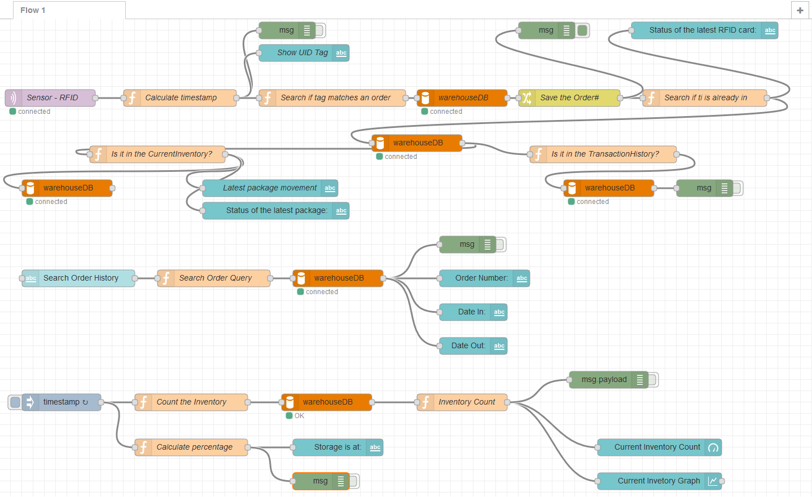

# WH-Manager

In this IoT project RFID tags are used to identify packages in a simulated warehouse. Data are sent from ESP8266 with the use of mqtt protocol to a mosquitto broker on the local server. With Node-RED a monitor is set up to follow the warehouse activity, capacity, etc. 

## About this project ##
This project features many different technologies in various degree:

•	RFID
•	SPI
•	MQTT
•	MYSQL databases
•	Node-RED platform
 

 
 

WiFi enabled RFID reader is setup at the warehouse gate.  The UID tag of each package is sent through WiFi to the local server. The RC522 reader is connected to ESP8266 with standard SPI interface. The microcontroller is using MQTT protocol to publish to the topic warehouse/rfid.
 
 
 

Messages are received by the server and given a timestamp. With the use of lookup table called ExpectedDeliveries that resides on a MYSQL database (all tables are) is determined if the RFID Tag corresponds to valid order. If not it is denied. 
 
 

If the tag corresponds to a valid order then the order and the timestamp are saved in a table called CurrentInventory. CurrentInvetory saves only the orders currently stored in the warehouse. Orders are also saved in a table called TransactionHistory that saves all the order movements.
If the same tag is passed through the reader that means that the package is now leaving the warehouse so it is deleted from the current inventory and the time of exit is stored as date-out in TransactionHistory table.

That way the warehouse manager through the UI can monitor in real time the incoming tags and orders. Also he can keep track of the items and their count. Additional functionality can be added by implementing alarms i.e. when reaching maximum capacity or an item is exiting the warehouse.

Keep in mind that this is a demo application and is not fully featured.
